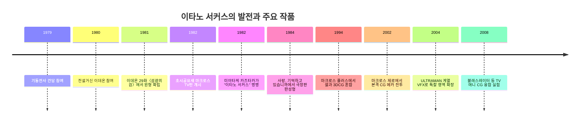

# 이타노 서커스 연구 정리

> 이 페이지는 원본 보고서 `sources/ItanoCircus.md`(src-itano-circus-report)의 본문을 위키 형식으로 옮긴 것임. 원본의 깨진 인용 마커(`citeturn…`)만 제거했고 서술은 그대로 보존함. **본 페이지 전체 내용의 출처는 위 단일 보고서**이며, 보고서가 표기한 미상/추정/자료 간 불일치도 원문대로 보존함. 기법 정의·프롬프트 적용 요약은 개념 페이지 [[이타노 서커스]] 참고.

## 핵심 요약

이타노 서커스는 일본 애니메이터 이타노 이치로가 확립한 전투 연출 문법으로, 단순히 "미사일을 많이 쏘는 장면"이 아니라 **고속 피사체와 고속 카메라, 왜곡된 공간 인식, 다층 미사일 궤도, 연기·폭발·원근의 동시 설계**가 결합된 복합적인 시각 시스템에 가깝다. CGWORLD의 정리는 이것을 "고속 이동하는 전투기·미사일을, 같은 속도로 이동하는 카메라가 추적하며, 초점거리까지 계산해 화면을 짜는 연출"로 설명한다. 명칭은 스튜디오 누에의 미야타케 카즈타카가 붙였고, 어원은 편대 곡예비행을 가리키는 "겐다 서커스"였다.

역사적으로 보면, 이타노는 1970년대 후반 애니메이션 현장에 들어가 《기동전사 건담》에서 속도감 있는 메카 컷으로 두각을 드러냈고, 《전설거신 이데온》 제29화 〈섬광의 검〉의 아디고 전투에서 "이타노 서커스의 시작"으로 회고되는 장면을 만들었다. 그 뒤 《초시공요새 마크로스》 TV판에서 메카 작화감독으로 폭발적인 발전을 이루고, 본인은 《초시공요새 마크로스 사랑, 기억하고 있습니까》를 TV판의 "시험 단계"를 넘어 하나로 정리된 완성형으로 인식했다. 이후 《마크로스 플러스》와 《마크로스 제로》를 거치며 3DCG 환경에까지 이 문법을 이식했다.

이번 조사에서 우선 검토한 1차 또는 1차에 가까운 자료는 이타노 본인 인터뷰, 마크로스 공식 시리즈 페이지와 공식 상영/홍보 문구, CG 전환기에 대한 본인 및 제자들의 증언, 그리고 일본 학술대회 논문이다. 공개 접근이 확인된 자료만 놓고 보면 **인터뷰·공식 스태프 표기·상영 코멘터리·전시 설명**은 충분했지만, **개별 컷의 원화 전부와 타임시트 전문은 본 보고서에서 특정 가능한 공개 링크로는 충분히 확보되지 않아 일부 항목은 미상**으로 남는다.

## 정의와 역사

이타노 서커스는 흔히 미사일 군무로 알려져 있지만, 핵심은 미사일의 "수"보다 **공간을 어떻게 거짓말하듯 설계해 속도를 체감시키느냐**에 있다. 이타노 자신은 마크로스 시절부터 삼점투시를 통해 공간 인지와 피사체 진로를 계산했고, 속도가 너무 빠르다거나 "하늘에서 왜 저렇게 구부러지느냐"는 비판이 있었음에도, 실제로는 속도와 원근을 계산한 결과라고 설명했다. 즉, 이 기법은 사실주의의 포기라기보다, **지각되는 리얼리티를 위해 물리적으로는 비틀어진 영상을 선택하는 연출술**이었다.

이타노의 경력 배경도 중요하다. 공식 프로필과 인터뷰들에 따르면 그는 1959년생으로 《기동전사 건담》에 원화로 참여했고, 《전설거신 이데온》의 메카·미사일 작화로 주목받았으며, 《초시공요새 마크로스》에서 메카 작화감독을 맡아 이름을 확립했다. 1994년의 《마크로스 플러스》부터는 3DCG 도입을 본격화했고, 2000년대에는 《마크로스 제로》와 《ULTRAMAN》 계열 작업을 통해 애니메이션과 특촬 양쪽에서 CG 기반의 "이타노 서커스"를 실험했다.

명칭의 탄생도 제작 문화사적으로 흥미롭다. 이타노 본인 인터뷰 요약과 CGWORLD 설명에 따르면, 1982년 《마이 애니메》 11월호에서 메카 디자이너 미야타케 카즈타카가 이타노의 전투 작화를 "이타노 서커스"라고 불렀고, 그 어원은 "겐다 서커스"였다. 다만, 빅터의 《메가존 23》 관련 인터뷰 발췌에는 이미 스태프들이 이타노의 전투 장면을 "서커스 같다"고 말해왔다는 증언도 있어, **현장 구어와 잡지 명명 사이에 시간차가 있었을 가능성**은 남아 있다. 잡지 명명 시점은 확인되지만, 현장 최초 사용 시점은 공개 자료상 미상이다.

또 하나의 배경은 실제 체험이다. 이타노는 《이데온》과 초기 마크로스 시기의 미사일 발상을 설명하면서 로켓 불꽃놀이를 떠올리며 장면을 그렸다고 회고했다. 이 일화는 종종 과장된 전설처럼 소비되지만, 중요한 것은 불꽃놀이의 다발성, 예측 불가성, 잔상과 연기의 흔적이 그의 미사일 연출 사고를 형성했다는 점이다. 그래서 이타노 서커스의 미사일은 탄도학보다 **시각적 쾌감과 궤도 조형**에 더 가깝다.

위 타임라인의 연대와 전환점은 이타노 본인 인터뷰, 마크로스 공식 시리즈 페이지, CGWORLD 용어 정리, 그리고 이데온 29화를 발원지로 지목한 증언을 바탕으로 정리했다.

## 시각적 특성과 기술 문법

이타노 서커스의 가장 중요한 특징은 **카메라가 피사체를 "기록"하는 것이 아니라, 속도감을 만들기 위해 공간을 능동적으로 왜곡한다는 점**이다. CGWORLD는 이 기법에서 초점거리까지 계산한다고 설명하고, 이타노와 제자들의 인터뷰는 "붙여 팬(付けPAN)"을 통해 피사체에 카메라를 붙여 흔들어야 스피드가 살아난다고 말한다. 이때 손앞의 물체는 광각처럼 과장되고, 멀리 있는 대상은 압축된 망원처럼 보이며, 경우에 따라 한 컷 안에서도 그 논리가 유연하게 바뀐다. 따라서 이타노 서커스의 카메라 워크는 영화적 렌즈 흉내이면서 동시에 **리미티드 애니메이션의 강한 데포르메**다.

미사일과 탄환 묘사는 단일 규칙으로 움직이지 않는다. CGWORLD와 2007년 일본 논문은 이타노 서커스를 구성하는 미사일을 세 종류로 정리한다. 하나는 목표로 곧장 향하는 타입, 하나는 미래 위치를 예측해 선회·선점을 노리는 타입, 하나는 화면에서 눈에 띄도록 거의 과시적으로 빗나가는 타입이다. 흥미롭게도 2007년 논문은 "우등생/수재"의 이름 배치를 일부 바꾸어 적고 있어, **개념 자체는 일치하지만 명명은 자료 간 불일치가 존재**한다. 본 보고서는 CGWORLD와 일반 통용 설명을 우선해 "직선형=우등생, 예측형=수재, 과시형=열등생"으로 서술하되, 학술 자료의 명명 차이는 병기한다.

연기, 트레일, 스모크는 장식이 아니라 속도 인지 장치다. 이타노 본인 인터뷰 요약과 제자 인터뷰는, 우주나 고고도 공간은 비교 대상이 없으면 빠르게 움직이는지 체감하기 어렵기 때문에, 미사일의 연기와 동행하는 다른 미사일, 카메라의 흔들림을 통해 공기와 공간을 "보이게" 해야 한다고 설명한다. 그래서 이타노 서커스의 백색 연기 선은 추적선이자 깊이 표시자이며, 이 때문에 "납두(納豆) 미사일"이라는 별칭까지 생겼다.

모션 블러와 잔상, 그리고 프레임 간격의 변화도 핵심이다. 이타노는 미사일이 어느 순간 셔터스피드보다 빨라지면 소시지처럼 늘어난다고 말했고, 실제 작업에서도 손앞의 미사일은 1코마, 중간은 2코마, 먼 곳은 3코마처럼 **한 장의 셀 안에서 서로 다른 프레임 밀도**를 병용했다고 증언했다. 즉, 이 기법의 속도감은 단순한 많은 그림이 아니라 **위치별 서로 다른 코마수와 길이 왜곡**에서 나온다.

색채와 조명은 셀 시대와 디지털 시대에 방식이 달라졌지만 기능은 비슷하다. 셀 시대에는 폭발의 에어브러시 그라데이션, 검은 우주 배경 위의 강한 발광체 대비, 연기와 불꽃의 층위가 속도감을 증폭했다. 디지털 전환기에는 이타노가 3D 애니메이터에게 폭발 에어브러시 같은 역할을 이해시키고, 자동보간의 "매끈함" 대신 요철과 왜곡, 수동 레터치, 일러스트풍 텍스처·라이팅을 통해 아날로그적 질감을 되찾도록 가르쳤다. 《마크로스 제로》는 공식 소개에서 2DCG+3DCG를 내세우고, 관련 공식 기사에서는 천신 히데타카의 일러스트적 텍스처 채용이 시대성을 덜 타는 미감을 만들었다고 설명한다.

아래 표는 기법 요소를 구현 방식 중심으로 다시 묶은 것이다.

| 시각 효과 | 구현 방법 | 예시 작품 |
|---|---|---|
| 렌즈 왜곡형 원근 | 광각/망원처럼 보이도록 피사체 거리별 비물리적 화각 운용, 붙여 팬으로 시점 결속 | 《초시공요새 마크로스》, 《마크로스 플러스》 |
| 미사일 군무 | 직선형·예측형·과시형 미사일을 섞어 서로 다른 궤적과 역할 부여 | 《이데온》 29화, 《마크로스》 TV판, 《마크로스 플러스》 |
| 스피드 강조 | 시작부 느리게, 끝부분 빠르게 혹은 반대로 조여주는 시간축 변형, 위치별 코마수 차등 | 《마크로스》 TV판, 《사랑, 기억하고 있습니까》 |
| 트레일/스모크 | 연기선으로 공간 깊이와 공기 저항의 시각적 대체물 생성 | 《이데온》 29화, 《마크로스》 TV판 |
| 폭발/광원 레이어 | 셀 시대 에어브러시 그라데이션, 디지털 시대 수동 레터치·합성 | 《사랑, 기억하고 있습니까》, 《마크로스 제로》 |
| 2D·3D 하이브리드 | 손그림 레이아웃/키와 3DCG를 섞고, AE 등 후반에서 곡률·왜곡·레터치 적용 | 《마크로스 플러스》, 《마크로스 제로》 |
| 한 장 셀의 다중 동세 | 여러 미사일·기체·배경을 한 셀에 겹치되 각기 다른 코마수로 설계 | 《마크로스》 TV판 |
| 수동 후처리 | "인력 레터치 필터"처럼 최종 단계에서 비물리적 보정 수행 | 《마크로스 제로》 이후 계보 |

이 표의 구성 원리는 CGWORLD의 정의, 2007·2013년 일본 연구, 이타노 및 제자 인터뷰, 그리고 마크로스 공식/제작사 소개 문구를 종합한 것이다. 특히 "화각", "속도 변화의 과장", "미사일 3유형", "2DCG+3DCG", "레터치"는 서로 다른 자료가 반복적으로 공통 지점으로 제시한다.

## 제작 기법과 자료 검토

셀 시대의 이타노 서커스는 생각보다 "레이어를 무한정 쌓는 방식"이 아니었다. 이타노는 《이데온》과 《마크로스》 시절에 4,000장의 셀을 거의 다 쓰며, 화면 가득한 미사일도 대부분 한 장의 셀 위에 해결했다고 말했다. 손앞 미사일은 1코마, 가운데는 2코마, 뒤는 3코마처럼 위치에 따라 프레임 밀도를 바꾸되, 전함·항공기·미사일을 한 화면에 함께 설계했다는 증언은, 이 기법이 단순한 폭주가 아니라 **엄격한 공간 관리 위의 과장**이었음을 보여준다.

디지털 전환 이후에도 핵심은 자동화가 아니라 **자동화의 불완전성에 개입하는 인간의 손**이었다. 이타노는 3D 소프트의 자동 보간이 "누루누루해서 CG 냄새가 난다"고 보고, 리미티드 애니메이션이 본래 갖고 있던 시간·공간의 왜곡을 3D 쪽에 다시 주입해야 한다고 주장했다. 그 결과 《마크로스 제로》에서는 본격 CG 메카 액션이 도입되었지만, 실제 완성도는 후반의 수동 레터치, 카메라 곡률, 한 장 배경 활용, 붙여 팬, 일러스트적 텍스처와 같은 비물리적 보정에 기대고 있었다.

《마크로스 플러스》는 그 중간 단계의 교과서적 사례다. 공식 시리즈 페이지는 이 작품의 극장판이 OVA 4화를 재편집하고 신작 영상을 추가한 판이라고 설명하며, 이타노를 특기감독으로 명기한다. 공식 상영 안내는 이 작품이 "당시로서는 드문 셀화와 3DCG의 결합"으로 화제가 되었고, 이른바 "전설의 5초"를 낳았다고 재강조한다. 전시 기사에 따르면 이 5초짜리 컷을 119코마 분량의 패널로 전시하기도 했다. 이때 중요한 것은 CG가 셀을 대체한 것이 아니라, **이타노적 시간 배치와 카메라 감각을 증폭하기 위한 또 하나의 층**이 되었다는 점이다.

1차 자료 검토의 관점에서 보면, 이번 조사에서 가장 신뢰도가 높았던 것은 이타노 본인의 장기 인터뷰 두 축이었다. 하나는 2005년 WEBアニメスタイル 인터뷰의 검색 스니펫들로, 여기에는 명명 유래, 《이데온》 29화의 발원, 로켓 불꽃놀이 회상, 모션 블러와 연기 집착 같은 구체 발언이 남아 있다. 다른 하나는 2014년 AREA JAPAN, 2021년 전파미(denfaminicogamer), 2024년 Dig-it 인터뷰로, 셀 시대의 코마 운용, 3DCG 도입 이유, After Effects 보정, 제자 양성, 《플러스》와 《제로》의 작업 인식이 비교적 직접적으로 기록되어 있다.

반면, **개별 컷의 원화 전체나 타임시트 전문**은 이번에 확보한 공개 링크 안에서는 충분히 열람되지 않았다. 다만 타임시트의 중요성 자체는 간접적으로 선명하다. 이타노는 《건담》 시절 연출이 중간 그림을 과도하게 넣어 속도감을 죽이자, 타임시트의 중할 지시를 지워버렸고, 그 결과 토미노가 오히려 더 빠른 표현을 긍정했다고 회고했다. 또 《마크로스 플러스》의 "전설의 5초"가 전시에서 수십·수백 패널의 과정으로 소개된 것은, 이 미학이 실제로는 **프레임 간격 관리의 예술**임을 방증한다.

## 대표 장면 분석

아래 표의 타임스탬프는 **판본별 차이를 고려한 분석용 권장 탐색 구간**이다. TV판은 스트리밍/YouTube판의 오프닝·엔딩 길이 차이, 극장판과 OVA는 복원·재편집판 차이 때문에 수십 초에서 수분 정도 오차가 날 수 있다. 정확한 컷 번호나 프레임 번호는 공개 자료상 대체로 미상이다. TV 제1화 러닝타임과 시리즈별 공개 여부는 마크로스 공식 채널/공식 시리즈 페이지, 이데온 29화 러닝타임은 스트리밍 서비스 표기를 참조했다.

| 작품 | 연도 | 권장 타임스탬프 | 스크린샷 추천 프레임 | 특징 요약 |
|---|---:|---|---|---|
| 《전설거신 이데온》 29화 〈섬광의 검〉 | 1981 | 약 13:00–17:00 | 아디고 미사일이 연기 궤적을 그리며 선회하는 순간 | 공개 증언상 "이타노 서커스의 시작"으로 지목되는 발원 장면 |
| 《초시공요새 마크로스》 1화 〈부비 트랩〉 | 1982 | 약 15:30–19:30 | VF-1이 장애물 뒤로 숨으며 미사일을 흘리는 순간 | TV판 초반부터 비정상적으로 높은 메카 밀도와 원근/폭발 운용 |
| 《초시공요새 마크로스》 18화 〈파인 샐러드〉 | 1983 | 약 17:30–21:00 | 맥스와 밀리아가 교차 회피 후 재진입하는 프레임 | 개념이 TV판에서 크게 확장된 대표 공중전 |
| 《초시공요새 마크로스》 27화 〈사랑은 흐른다〉 | 1983 | 약 10:30–14:30, 18:00 전후 | 공격선이 화면 전후를 뒤집는 순간 | 시리즈 클라이맥스이자 TV판 최상급 이타노 서커스 집약 |
| 《초시공요새 마크로스 사랑, 기억하고 있습니까》 | 1984 | 판본별 상이, 종반 전투부 | 민메이 노래 뒤편에서 전투가 계속되는 프레임, 회랑 회전 격추 컷 | 이타노 본인이 "정리되어 완성된 단계"로 회고한 극장판 완성형 |
| 《마크로스 플러스》 OVA / MOVIE EDITION | 1994–1995 | OVA 1화 중반부, MOVIE 후반부 | 고스트 X-9 미사일을 회피하는 5초 구간의 중앙 프레임 | 셀+3DCG 혼합과 "전설의 5초"로 대표되는 절정기 |
| 《마크로스 제로》 2화 | 2002–2003 | 약 18:00–22:00 | 협곡을 타며 선회하는 VF-0/SV-51 교차 컷 | CG 시대에 시간·공간 데포르메를 이식한 하이브리드형 |

장면 식별과 중요도 평가는 이타노 인터뷰, 반다이 채널·공식 마크로스 기사, V-STORAGE의 《제로》 해설, 그리고 이데온 29화 발원 증언을 바탕으로 정리했다.

**《전설거신 이데온》 29화 〈섬광의 검〉**
이 장면의 역사적 의미는 거의 반론이 없다. 이타노 본인 인터뷰 스니펫은 "이데온 29화의 아디고부터"라고 직접 말하고, 스트리밍/서비스 안내도 그 회차의 적이 바로 아디고임을 확인해 준다. 프레임 단계로 보면, 첫 단계는 발사체가 목표를 곧장 향하지 않고 화면 안에서 먼저 "존재감을 과시"하는 확산이고, 둘째 단계는 카메라가 표적보다 미사일 군을 체험하게 만드는 추적이며, 셋째 단계는 연기 선으로 깊이가 확보되면서 화면이 평면 도식에서 입체 공간으로 전환되는 순간이다. 아직 마크로스만큼 세련되지는 않지만, **연기 궤적·선회·원근감이 동시에 작동하는 최초의 원형**이라는 점에서 이타노 서커스다. 정확한 원화 컷 번호는 공개 자료상 미상이다.

**《초시공요새 마크로스》 1화 〈부비 트랩〉**
1화는 단지 시작 회차가 아니라, TV 애니메이션으로는 비정상적인 메카 밀도와 폭발 묘사의 선언이다. 공식 시리즈 페이지는 이타노를 TV판 메카 작화감독으로 명시하고, 반다이 채널 기사는 제1화에서 적 우주전함의 표면 장갑선과 미세한 요철, 폭발 디테일까지 생략 없이 그려 충격을 줬다고 평가한다. 장면 구조상 초반 프레임은 거대한 함체의 무게를 보여주고, 중간 프레임에서 카메라는 고정 관찰자가 아니라 기체와 함께 움직이는 체험 시점으로 돌입하며, 후반 프레임에서 미사일과 폭발, 회피 동선이 도시 장애물을 매개로 얽히며 공간이 다층화된다. 이 장면이 중요한 이유는 **이타노 서커스가 TV판 초반부터 이미 '미사일+배경+카메라'를 한 번에 설계하는 방식**으로 제시됐기 때문이다.

**《초시공요새 마크로스》 18화 〈파인 샐러드〉**
이타노 자신은 Dig-it 인터뷰에서 TV판에서 구상이 크게 넓어진 순간으로 "맥스·밀리아전"을 꼽았고, 반다이 채널 기사도 이타노 서커스가 특히 볼 만한 회차로 18화를 지목했다. 프레임 단계로 보면, 첫 국면은 접근과 스치기다. 두 기체는 정면 충돌하지 않고 교차하면서 "서로의 궤도를 읽는" 듯한 인상을 남긴다. 둘째 국면에서는 카메라가 어느 한쪽의 객관숏으로 머물지 않고, 두 기체 사이를 비집고 돌거나 사선으로 비껴나가며 전경·후경을 뒤집는다. 셋째 국면에서는 미사일·탄환·기체의 방향이 일치하지 않기 때문에, 관객은 직선적 전투가 아니라 **벡터들의 합성**을 보게 된다. 이 장면이 이타노 서커스인 이유는, 단순한 개수 경쟁이 아니라 **카메라와 표적 기동이 서로를 규정하는 공중전**이기 때문이다.

**《초시공요새 마크로스》 27화 〈사랑은 흐른다〉**
27화는 TV판의 기술적·미학적 정점으로 반복해서 언급된다. 반다이 채널은 이 회차에서 이타노, 안노, 3세대급 인력이 겹쳐 보인다고 소개하고, 아니메스타일 칼럼 역시 시리즈 전체의 클라이맥스를 27화로 본다. 장면 분석상 이 회차의 이타노 서커스는 두 종류가 공존한다. 하나는 지상과 우주, 군집과 개인 기동을 같은 에피소드 안에서 오가는 **스케일의 비약**이다. 다른 하나는 노래와 전투의 동시성이다. Dig-it 인터뷰에서 이타노는 극장판에서도 "민메이에 핀트를 맞추고 뒤 전투는 루프로 뭉개도 되는데, 전부 성실하게 그렸다"고 말했는데, 27화 TV판 역시 그 전조처럼 **배경이어야 할 전투를 전면적 이벤트로 끌어올린다**. 프레임 단계에서는 미사일 확산, 전경 돌입, 폭발과 재진입, 화면 외 공간의 암시가 반복 리듬을 만든다.

**《초시공요새 마크로스 사랑, 기억하고 있습니까》**
이타노는 Dig-it 인터뷰에서 TV판의 시도들을 "시험 단계"로 보고, 이것이 정리되어 완성된 것이 극장판이라고 회고했다. 공식 시리즈 페이지도 민메이의 노래와 함께 전개되는 메카 액션을 시리즈 굴지의 명장면으로 규정한다. 특히 이타노가 직접 언급한 것은 라스트의 보돌 함 내부 회랑 전투와, 우주를 메운 대함대·무한 미사일·노래와 동시 진행되는 배경 전투다. 프레임 단계로 보면, 첫 단계는 발사와 회피보다 **전장의 총체성**을 보여주는 구축이고, 둘째 단계는 카메라가 회랑이나 기체 표면을 따라 휘며 원근을 찢는 구간이며, 셋째 단계는 표적기와 발사체, 폭발, 노래의 리듬을 하나의 몽타주로 압축하는 부분이다. 이 장면이 이타노 서커스인 이유는, 미사일 회피라는 패턴을 넘어 **대규모 전장·주관 카메라·음악적 타이밍**까지 통합했기 때문이다. 정확한 컷별 원화 배분은 공개 링크상 일부만 확인되며, 전체 컷 분해는 미상이다.

**《마크로스 플러스》 OVA / MOVIE EDITION**
《플러스》는 이타노 서커스가 단순히 "셀 시대의 기적"이 아니라는 것을 증명한 작품이다. 이타노는 이 작품에서 "고스트 X-9가 쏜 미사일을 피하는 것"을 자신이 직접 해본 대표 사례로 들었고, 공식 마크로스 페이지는 그를 특기감독으로 적는다. 공식 상영 홍보는 셀과 3DCG의 결합, 그리고 "전설의 5초"를 반복해서 강조한다. 장면을 프레임 단계로 풀면, 첫 단계는 미사일 분산 발사와 카메라의 방향 전복, 둘째 단계는 기체가 화면 중심을 잠시 비우면서 미사일이 주역이 되는 국면, 셋째 단계는 거의 추상화될 정도의 속도 압축, 마지막 단계는 다시 기체 형상이 분명해지며 탈출 벡터를 확정하는 국면이다. 이 작품이 중요한 이유는, 이타노 서커스의 본질이 "많은 선"이 아니라 **시간 압축과 공간 비틀기**라는 사실을 셀+CG 혼합으로 재증명했기 때문이다. 공식 고정 타임스탬프는 미공시다.

**《마크로스 제로》 2화 협곡전**
《제로》는 기법의 계보상 또 다른 도약이다. 공식 시리즈 페이지와 제작사 소개는 이 작품을 시리즈 첫 풀CG 메카 액션의 전환점으로 규정하고, V-STORAGE 평론은 2화의 협곡전과 1화의 대운해 조우전 등을 대표 전투로 꼽는다. 장면의 프레임 단계는, 첫째 협곡 지형을 이용해 시차를 만들고, 둘째 붙여 팬과 레이아웃 왜곡으로 "속도가 실제보다 빨라 보이게" 한 다음, 셋째 수동 레터치와 일러스트풍 질감으로 기체의 중량감을 되살리는 구조다. 이타노가 3D 애니메이터들에게 가르친 "시간과 공간의 데포르메", "After Effects로라도 휘게 하라", "정면은 설계도처럼 보이니 피하라"는 원칙이 이 장면에 가장 선명하다. 따라서 《제로》의 협곡전은 CG로 만든 이타노 서커스가 아니라, **CG를 이타노 서커스 쪽으로 굴절시킨 사례**에 가깝다.

## 영향과 변형

이타노 서커스의 영향은 "후배들이 미사일을 많이 그린다"는 수준을 훨씬 넘는다. 프레임을 아끼는 리미티드 애니메이션 환경에서도 공간과 시간축을 왜곡해 속도와 깊이를 만들어낼 수 있다는 사고방식 자체가 이후 세대에 전수됐다. 대표적으로 안노 히데아키는 2014년 행사 관련 보도에서 미야자키 하야오에게서 레이아웃을, 이타노 이치로에게서 공간을 배웠다고 말했고, 다른 기사에서는 프로가 되고 싶다고 결심하게 만든 계기가 이타노의 원화를 본 일이었다고 회고했다.

스튜디오와 기술 계보 차원에서는 《마크로스 제로》가 특히 중요하다. V-STORAGE는 이 작품이 CG 메카 액션의 방향성을 업계에 제시했고, 사테라이트 주변 CG 인력들이 이후 《극장판 마크로스 F》, 《AKB0048》, 《마크로스 Δ》 등으로 계보를 이어갔다고 정리한다. 전파미 인터뷰에서도 제자들은 《마크로스 제로》에서 자신들이 "애니메이터"라고 불린 경험이 자의식을 바꾸었다고 말하고, 이타노는 이들이 후속 산업에서 핵심 인력이 됐다고 설명한다. 즉 영향은 미장센뿐 아니라 **인력 양성 모델**로도 작동했다.

현대의 2D/CG 하이브리드 응용은 이타노 자신이 의도적으로 설계한 방향이었다. 그는 마크로스의 전투를 3D에서 옮길 때 자동 보간을 거부하고, 시간축의 강조점, 카메라 곡률, 수동 레터치 같은 2D의 문법을 3D 작업에 다시 주입해야 한다고 주장했다. 이 때문에 후대의 "CG판 이타노 서커스"는 사실상 **물리적으로 맞는 시뮬레이션**이 아니라 **물리적으로 틀리더라도 시각적으로 설득력 있는 연출**을 지향하게 되었다.

영향권은 일본 애니메이션 밖으로도 뻗었다. 마이너비 인터뷰에서 이타노는 닐 블롬캠프가 《마크로스》를 좋아해 《디스트릭트 9》의 파워드수트 미사일 발사 장면에 "이타노 서커스적인" 비행법이 들어갔다는 말을 듣고 놀랐지만 기뻤다고 말했다. 한국에서는 조성희 감독이 《승리호》의 우주선 액션 레퍼런스로 마크로스의 "이타노 서커스"를 직접 언급했다. 그러므로 이 기법은 오늘날 **일본 메카 애니의 전유물이 아니라, 글로벌 SF 전투 연출의 참고문헌**에 가까워졌다.

## 비판과 한계

이타노 서커스는 처음부터 모두에게 환영받은 문법이 아니었다. 이타노는 마크로스 당시 주변에서 "너무 빠르다", "하늘에서 저렇게 구불구불 꺾이는 건 의미가 없다", "납두 미사일" 같다는 반응을 들었다고 회고한다. 이는 단순 취향 차이가 아니라, 당시 TV 애니메이션의 보수적 전투 문법과 정면 충돌했다는 뜻이다. 오히려 이 비판 덕분에 이타노 서커스의 정체가 분명해진 측면도 있다. 그것은 사실적 묘사라기보다, **체감 속도와 전장 체험의 과장**을 목표로 했기 때문이다.

또 하나의 한계는 **표피적 모사**다. CGWORLD와 이타노 인터뷰들은 반복해서, 이 기법의 본질이 "미사일 다발"이 아니라 카메라·렌즈·시간축·폭발·원근이 통합된 화면 설계라고 말한다. 따라서 많은 후대 연출이 수많은 발사체만 나열하고 렌즈 왜곡과 공간적 리듬을 놓치면, 그것은 이타노 서커스의 인상만 빌린 클리셰가 되기 쉽다. 이 점은 현대 CG 환경에서 특히 두드러진다. 물리 엔진이나 자동 보간은 궤적을 쉽게 만들지만, 이타노식 "나쁜 거짓말"을 자동으로 만들어주지는 못하기 때문이다.

생산성의 문제도 크다. 2007년과 2013년 일본 연구는 복잡한 미사일 애니메이션이 손작업으로는 시간과 노력이 과도하게 드는 탓에, 이를 알고리즘화하는 연구가 필요하다고 설명한다. 이타노 본인도 셀 시대에 거의 모든 요소를 한 장에 그려 넣는 방식이 더는 당연하지 않은 시대가 왔다고 말한다. 즉, 이타노 서커스는 미학적으로는 강력하지만, 파이프라인 차원에서는 **극단적으로 숙련 의존적이고 비용이 큰 연출**이다. 이 때문에 과잉 사용보다는 작품의 클라이맥스나 결정적 추격전에서 제한적으로 쓰일 때 가장 효과적이었다고 보는 편이 타당하다.

장르적 한계도 있다. 본래 이 문법은 메카, 전투기, 우주전, 고속 추격전처럼 **벡터가 분명하고 입체 기동이 많은 장르**에서 가장 빛난다. 인물 중심의 정서극이나 저속 지상 액션에 그대로 옮기면, 과장된 카메라와 궤적이 서사를 압도할 위험이 있다. 그래서 이타노 자신도 모든 장면을 이렇게 처리한 것이 아니라, 특정 장면에서만 속도와 충격을 폭발시키는 방식으로 사용했다. 다시 말해 이타노 서커스는 만능 기법이 아니라, **클라이맥스용 고압 연출 장치**에 가깝다.

## 관련 문서
- [[이타노 서커스]]
- [[카나다 스타일 연구 정리]]
- [[스토리보드 프롬프트 템플릿]]
- [[Seedance 모션 프롬프트 템플릿]]
