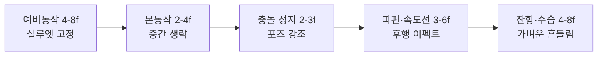

# 카나다 스타일의 작화 문법과 현대적 계승

카나다 요시노리의 이른바 ‘카나다 스타일’은 단순히 과장된 포즈나 화려한 폭발을 뜻하지 않는다. 그것은 **광각적으로 왜곡된 공간 구성, 포즈-투-포즈 중심의 비연속적 타이밍, 물리 법칙보다 화면 충격을 우선하는 이펙트 설계, 그리고 컷 내부의 카메라까지 함께 ‘연기’시키는 액션 연출**이 결합된 하나의 총체적 시스템이다. 문화청 메디아예술제의 수상 사유가 지적하듯, 카나다는 “예상 밖의 액션”과 “대담한 프레이밍”을 통해 로직을 넘어서는 시각적 쾌감을 만들었고, 그 영향은 애니메이션을 넘어 게임과 현대 시각문화 전반으로 확장되었다. 또한 린 타로는 그의 강점을 “시간축의 사용법”과 “한 프레임에 대한 집념”으로 요약하며, 그 독특한 ‘간(間)’이 포로워를 낳았다고 설명했다. citeturn23view3turn44view0

엄밀하게 말해 금전적·일정 제약이 큰 일본 TV 애니메이션의 리미티드 시스템이 카나다 스타일의 토양이었지만, 카나다는 그 제약을 결핍이 아니라 **디자인된 비약, 선택적 생략, 의도적인 부조화**로 전환했다. 그 결과 1970년대 후반 로봇 애니메이션과 극장 애니메이션에서 스타일이 가시화되었고, 1980년대에는 이펙트와 액션 연출의 기준점을 재정의했으며, 이후 야마시타 마사히토, 이타노 이치로, 오바리 마사미, 이마이시 히로유키, 카메다 요시미치 등 여러 세대에 걸친 계보를 형성했다. 이 보고서는 그 계보와 형식적 구조를 분해해, 카나다 스타일을 미학과 기술의 양면에서 재구성한다. citeturn23view3turn27search0turn27search2turn14search0turn23view1

## 정의와 계보

카나다 요시노리는 1970년 도에이 동화에 입사해 《魔法のマコちゃん》으로 동화 데뷔를 했고, 이후 스튜디오 Z와 스튜디오 No.1을 거치며 《大空魔竜ガイキング》, 《無敵超人ザンボット3》, 《無敵鋼人ダイターン3》, 《さらば宇宙戦艦ヤマト 愛の戦士たち》, 《銀河鉄道999》, 《幻魔大戦》, 《風の谷のナウシカ》, 《天空の城ラピュタ》 등으로 자신의 양식을 정립했다. 문화청 메디아예술제는 바로 이 경로를 그의 핵심 경력으로 정리하면서, 약 40년에 걸친 영향력과 후진 양성, 그리고 장르 전반에 대한 파급력을 공식적으로 인정했다. citeturn23view3

‘카나다 스타일’ 또는 일본어로 흔히 말하는 **金田系 / 金田流**는, 원작·설정보다도 **움직임이 어떻게 ‘보이는가’**를 최우선으로 삼는 작화 경향을 뜻한다. 작화 용어 정리에서는 이를 “金田動き”, “金田ビーム”, “金田爆発”으로 나누어 설명하며, 캐릭터 동작의 과감한 생략과 집중선·효과선의 난입, 곡선 궤적을 지닌 빔, 생물처럼 행동하는 폭발이 전형적 요소라고 요약한다. 린 타로 역시 카나다의 독창성을 “일본 특유의 리미티드 애니메이션의 간을 만든 사람”이라는 맥락에서 설명한다. 즉 카나다 스타일은 사실상 **리미티드 애니메이션의 고유한 시간 문법을 공격적으로 밀어붙인 결과**라고 보는 편이 정확하다. citeturn22search11turn44view0

형식적 기원만 놓고 보면, 카나다는 완전히 무(無)에서 출발한 것이 아니다. JAniCA의 레이아웃 역사 강의 자료는 미야자키 하야오가 1970년대 전반에 광각·공간 왜곡과 카메라 위치 의식을 발전시켰고, 그 뒤 카나다가 《ダイターン3》 시기 “움직임과 앵글로 광각의 공간 표현을 밀어붙였다”고 정리한다. 동시에 상처나 리얼리즘이 아니라 **과장된 전경-후경 대비와 근거리 렌즈 효과**를 결합해, 공간을 ‘정확히 묘사하는’ 것이 아니라 ‘밀어내고 당기며 느끼게 하는’ 방식으로 전환했다는 점이 중요하다. citeturn29view0

카나다의 각도와 구도 감각에는 망가가인 모치즈키 미키야의 《ワイルド7》과, 실상사 아키오가 연출한 《ウルトラセブン》의 극단적 앵글 감각이 영향을 주었다는 증언도 있다. 애니메이터 코즈마 신사쿠는 카나다의 타이밍이 본질적으로 “화면 만들기(画作り)”에서 왔고, 권총을 뽑는 장면의 카메라 앵글 같은 것은 모치즈키의 영향이 크다고 증언했다. 이 지점은 카나다 스타일을 단순한 ‘폭발 작화’로 환원할 수 없다는 중요한 단서다. 그의 방식은 이펙트가 아니라 **구도 전체의 리듬**에서 시작한다. citeturn45view0

‘건담’과 ‘이데온’, 그리고 《천원돌파 그렌라간》은 카나다 스타일의 직접·간접 맥락을 이해하는 데 중요하다. 《機動戦士ガンダム》 4화 「ルナツー脱出作戦」의 공식 리마스터 해설은 해당 화의 작화를 스튜디오 Z가 담당했으며, 《ザンボット3》《ダイターン3》에서 카나다를 중심으로 한 파격적 액션의 연장선으로 이해할 수 있다고 소개한다. 반면 《전설거신 이데온》은 공식 사이트가 보여주듯 토미노/코가와 체제의 거대한 우주 스케일과 광신적 에너지 연출을 대표하며, 후대에 “카나다계”와 결합된 과잉 로봇 액션의 감수성을 강화한 주변 맥락으로 작동했다. 그리고 《그렌라간》 관련 인터뷰·회고에서 이마이시 히로유키는 반복적으로 “金田系”라는 표현을 전제하고 말하며, 대외적으로도 카나다의 광각·과장·스피드가 자기 스타일의 직접 선행으로 수용되어 왔다. 《그렌라간》은 따라서 카나다의 직접 참여작은 아니지만, **카나다 스타일의 가장 노골적인 21세기적 재번역본**으로 보는 것이 적절하다. citeturn43search2turn41view0turn12search3turn14search0turn14search6

## 형식 분석

### 작화

카나다 스타일의 작화는 ‘잘 그린 인체’보다 **잘 터지는 실루엣**을 우선한다. 전경의 손, 주먹, 발, 총구, 메카 파츠는 과감하게 확대되고, 후경은 눌리거나 밀리며, 몸통과 골반은 비틀려도 실루엣 중심축은 선명하게 읽히도록 설계된다. 문화청 수상 사유가 언급한 “대담한 프레이밍”과 “예측 불가능한 액션”, JAniCA 자료가 말하는 “광각의 공간 표현”, 그리고 E-IMPACT 논문이 예시로 든 “손앞이 크게 보이는 광각 렌즈적 인상”은 모두 같은 현상을 다른 말로 지칭한다. 카나다의 그림은 원근법의 정확성보다 **충돌 직전의 긴장**과 **화면으로 튀어나오는 벡터**를 설계한다는 점에서, 데생적 리얼리즘과는 다른 차원의 설득력을 가진다. citeturn23view3turn29view0turn24view0

반복 모티프는 꽤 명확하다. 캐릭터는 흔히 허리와 어깨를 역방향으로 틀고, 팔 하나 또는 다리 하나를 과도하게 전경으로 뻗으며, 척추는 활처럼 휘거나 S자 궤적을 만든다. 메카닉 역시 정직한 박스형보다 **부위별로 서로 다른 시점을 동시에 품은 것처럼** 보이는데, E-IMPACT는 바로 이 점을 “멀티 퍼스펙티브”라는 공학적 언어로 해석했다. 즉 카나다 스타일의 핵심은 단순한 왜곡이 아니라, **관절과 목표점별로 서로 다른 카메라 파라미터를 가상적으로 적용한 것과 유사한 시각 효과**다. 오늘날 3D 분야에서 카나다 파스를 모사하려는 연구가 존재한다는 사실 자체가, 이 효과가 우발적 럭키샷이 아니라 구조적 기법이었음을 방증한다. citeturn24view0turn24view2

구현 기법으로 정리하면 세 단계다. 첫째, 카메라에 가장 가까운 ‘지배 파츠’를 정하고 그 파츠가 장면의 관점축을 결정하도록 만든다. 둘째, 몸 전체는 해부학이 아니라 **속도 방향**을 따라 재배치한다. 셋째, 세부 묘사는 전부가 아니라 전면 윤곽, 관절 접점, 하이라이트가 모이는 부위에만 집중한다. 그래서 카나다 작화는 어떤 프레임을 멈춰 보면 종종 불균질하고 비논리적으로 보이지만, 연속 재생에서는 유난히 명쾌하고 공격적이다. 이는 “정지화의 옳음”이 아니라 “이동 중 실루엣의 읽힘”을 기준으로 설계되었기 때문이다. citeturn24view0turn29view0turn22search11

### 타이밍

카나다 스타일의 타이밍은 연속보다 **단차(段差)**를 사랑한다. 필름아트 인터뷰에서 이노우에 토시유키가 설명한 바와 같이, 카나다·야마시타·코즈마 계열은 1코마, 2코마, 3코마, 4코마, 6코마를 뒤섞는 “乱れ打ち”를 통해, 중간이 비어 보여도 궤도의 설득력이 무너지지 않는 독특한 쾌감을 만든다. 여기에 린 타로가 말한 “시간축의 사용법”이 더해지면, 카나다의 타이밍은 단순히 빠른 것이 아니라 **정지-폭발-정지-잔향**의 파형을 가진다고 정리할 수 있다. citeturn23view0turn44view0

상세하게 보면, 카나다식 컷은 보통 예비동작을 짧지 않게 잡는다. 이 예비동작은 자연스러운 준비라기보다 “터질 준비가 되어 있음을 관객에게 각인시키는 포즈”다. 그 다음 본동작은 중간을 과감히 건너뛰며 1~2번의 큰 점프로 처리되고, 충돌 순간은 오히려 짧은 정지나 얼어붙은 임팩트 포즈로 강조된다. 이후 파편, 속도선, 연기, 섬광 같은 이펙트가 뒤늦게 따라잡으며, 마지막에는 여운을 남기는 잔상 또는 후속 흔들림이 들어간다. 즉 **실제 운동학의 가속-감속 곡선**이 아니라, **지각적 하이라이트가 어디에 있는가**를 우선하는 편집적 타이밍이다. citeturn23view0turn44view0

코즈마 신사쿠의 증언은 이 독특한 타이밍 감각이 계산기적 계수보다 직관과 화면 감각에서 왔음을 보여준다. 그는 카나다와 야마시타가 타이밍을 잡을 때 스톱워치를 거의 쓰지 않았다고 말하며, 카나다식 리듬은 “대사 프레임의 감각”과 “화면 만들기”에서 왔다고 설명한다. 이것은 카나다 스타일을 숫자만으로 복원할 수 없게 만드는 지점이지만, 동시에 복원 전략의 방향도 알려 준다. **키 포즈와 궤도, 충돌 지점이 먼저이고, 노출 길이는 그 다음**이다. citeturn45view0

아래 도표는 여러 카나다계 컷에서 반복되는 전형적 타이밍 구조를 압축한 것이다. 이는 특정 컷의 실측 전사본이 아니라, 공개된 컷 배정 정보와 카나다계의 乱れ打ち 관행을 바탕으로 재구성한 분석 모델이다. citeturn23view0turn45view0

| 구간 | 권장 노출 범위 | 기능 | 카나다계에서의 효과 |
|---|---:|---|---|
| 예비동작 | 4–8f | 힘 축적, 실루엣 인지 | 포즈 자체가 기억된다 |
| 본동작 | 2–4f | 순간 이동에 가까운 점프 | 체감 속도가 급상승한다 |
| 충돌 정지 | 2–3f | 임팩트 표식 | ‘맞았다’는 감각이 남는다 |
| 후행 이펙트 | 3–6f | 파편·광·연기 분리 | 동작보다 결과가 크게 보인다 |
| 잔향 | 4–8f | 흔들림 또는 페이드 | 컷의 마침표가 생긴다 |

### 이펙트

카나다 스타일의 이펙트는 보조 요소가 아니라 **서사의 주체**다. 글로서리 수준의 작화 용어 정리에서도 “金田ビーム”과 “金田爆発”이 별도 항목으로 분리될 정도로, 카나다는 캐릭터 연기만큼이나 빔·폭발·연기·파편의 동작을 설계했다. 문화청 수상 사유가 강조한 “예측 불가능한 액션”은 사실 캐릭터보다 이펙트에서 더 극적으로 드러난다. 폭발은 둥근 연기 구름으로 퍼지지 않고, 꽃잎처럼 찢기며, 선단이 갈라지고, 중심압이 바뀌고, 파편이 이차 폭발로 이어진다. 빔은 직선 광선이 아니라 **휘고 꺾이고 굽이치는 살아 있는 물체**처럼 보인다. citeturn22search11turn23view3turn44view0

반복 모티프는 세 가지로 묶을 수 있다. 첫째, **곡선형 빔**이다. 선두가 뾰족하고 몸체가 비틀린 듯한 빔은 화면 안에서 방향을 바꿀 수 있는 ‘그려진 에너지’로 보인다. 둘째, **꽃잎형 또는 파열형 폭발**이다. 원형 팽창보다 토막난 덩어리와 불균일한 궤적이 강조된다. 셋째, **금속 표면의 반사광을 과장한 하이라이트**다. 후대 애니메이터들은 이를 흔히 “金田光り”라 부르며, 단순한 투과광보다 브러시성 번짐과 반사광으로 복원해야 한다고 설명한다. 2000년대 게임 오프닝 제작 현장에서도 카나다 특유의 이펙트를 살리기 위해 2D 방식을 고집했다는 증언이 남아 있다. citeturn22search11turn37search9turn23view2

구현 면에서 핵심은 이펙트를 물리 시뮬레이션이 아니라 **형태 변형의 연속**으로 다루는 것이다. 먼저, 폭발 씨앗(seed) 형태를 정한다. 다음 프레임에서는 볼륨을 보존하기보다 방향을 분기시켜 찢는다. 그 다음 파편과 속도선을 별개 레이어처럼 인식해, 충돌체보다 늦게 또는 먼저 도달하게 만든다. 따라서 카나다 이펙트는 실제보다 더 “어긋나게” 움직이지만, 그 어긋남이 오히려 폭발과 에너지의 낯선 생명력을 만든다. 바로 이 지점 때문에 카나다 계열의 폭발은 지금 봐도 **컴퓨터가 아닌 손으로 설계한 시간적 조형물**처럼 느껴진다. citeturn22search11turn23view2turn45view0

### 액션 연출

카나다 스타일의 액션 연출은 개별 드로잉의 문제가 아니라 **컷 내부의 카메라 설계** 문제다. JAniCA 자료는 광각이 불안정감과 현장감을, 망원이 안정감과 보편성을 준다고 설명하는데, 카나다는 전자를 극단화한 쪽에 가깝다. 그는 카메라가 인물 옆에 ‘서 있는’ 것처럼 보이게 만들기보다, 카메라가 인물과 함께 **밀려들고 휘청이고 들이받는** 듯한 감각을 선호한다. 그래서 그의 액션 컷은 종종 공간 연속성이 살짝 희생되더라도, 순간적 에너지의 수치가 높다. citeturn29view0

반복 모티프는 저각도 돌진, 전경을 가르는 무기·팔·메카 파츠, 충돌 직전의 급격한 클로즈업, 충돌 이후의 역방향 오버슈트다. 컷 분할 역시 인물의 실제 동선보다 **포즈의 완결성**을 기준으로 이루어진다. 한 컷에서 충분히 멋진 포즈가 나오면, 그 포즈를 중심으로 컷이 설계되고 주변 연속은 후퇴한다. 이 때문에 카나다 스타일은 실사식 커버리지와는 다르게, 때로는 컷마다 공간 법칙이 새로 갱신되는 듯 보인다. 하지만 각 컷이 독립적 표어처럼 또렷하기 때문에 전체 시퀀스의 리듬은 오히려 강해진다. citeturn23view3turn29view0

구현 기법을 실무적으로 옮기면 다음과 같다. 먼저 컷마다 “한 번에 기억될 포즈”를 정한다. 그 다음 카메라를 그 포즈에 복속시킨다. 마지막으로, 충돌·파편·광량의 피크가 어느 프레임에 올지 결정하고, 이펙트 레이어를 그 프레임 기준으로 앞뒤에 시차 배치한다. 카나다 액션은 결국 **동작을 그리는 것**이 아니라 **동작과 카메라와 이펙트가 한꺼번에 포즈를 취하도록 만드는 것**이다. citeturn29view0turn44view0turn45view0

## 사례 연구

아래 이미지는 본 절에서 반복적으로 언급할 작품들의 대표적인 시각 자료다. 나우시카와 라퓨타의 이미지는 지브리 공식 스틸, 이데온 이미지는 공식 사이트, 환마대전은 공개 영화 비주얼이다. 이들 이미지는 개별 컷 분석용 프레임 캡처라기보다, 작품별 화면 감수성을 빠르게 환기하는 참조材料로 보는 편이 옳다. citeturn26image0turn26image1turn41view0turn26image5

iturn26image0turn26image1turn25image7turn26image5

사례 분석에 적는 프레임 수와 컷 길이는 **공개된 컷 배정 정보**와 카나다계 특유의 乱れ打ち, 예비동작-본동작-임팩트-후행이펙트 구조를 바탕으로 재구성한 **추정치**다. 따라서 블루레이 프레임 단위의 완전 실측 전사본이 아니라, 작화 문법을 비교하기 위한 분석 모델로 읽는 것이 정확하다. 근거가 되는 컷 담당 정보와 타이밍 이론은 각 사례 끝에 함께 표시했다. citeturn23view0turn45view0

### 무적초인 잔봇3

《無敵超人ザンボット3》 10화는 카나다 스타일의 원형이 응축된 초기 사례다. 작화 위키는 이 화의 작화에 카나다가 직접 참여했고, 전차 액션과 잔봇3 대 트라시드 전투의 강도를 지적한다. 선라이즈의 촬영감독 토크 역시 바로 이 작품에서 카나다가 그린 컷을 “긴박한 감정이 나올 때 효과선과 그림자가 격렬하게 들어간 사례”로 거론한다. 즉 여기서 이미 **캐릭터 감정선과 이펙트 선량(線量)을 결합하는 방식**이 완성 단계에 가까워진다. citeturn16search8turn17search0

재구성 타이밍으로 보면, 잔봇3의 타격 컷은 약 18~22f 범위에서 자주 설명될 수 있다. 전조 포즈 6f, 돌진 4f, 충돌 2f, 파편·속도선 4f, 착지·잔향 4~6f의 구조다. 이 컷군의 핵심은 충돌 순간보다 **충돌 직전의 광각 포즈**가 더 기억된다는 점이다. 포즈-투-포즈 전환은 중간자세를 채워 넣기보다, 관객이 “이미 맞았다”고 상상하게 만들 수 있는 거리에서 과감히 도약한다. 초기작임에도 이미 선이 감정을 대신 말하고, 그림자가 에너지의 세기를 대신 말한다.  
**간단 출처**: 《ザンボット3》 관련 작화 정보와 선라이즈 토크 기록. citeturn16search8turn17search0

### 안녕, 우주전함 야마토 사랑의 전사들

《さらば宇宙戦艦ヤマト 愛の戦士たち》에서 카나다는 코스모 타이거 출격부터 유키가 숨을 거두는 구간까지를 맡은 것으로 정리된다. 이 작품은 카나다 액션이 TV의 즉흥성과 극장판의 밀도를 결합한 첫 번째 거대 쇼케이스 중 하나다. 특히 전투기 발진, 도시 제국을 향한 가속, 빔·폭발의 이차 반응이 한 스팬 안에서 연결되며, 이후 야마토 계열 카나다 액션의 문법이 거의 완성된다. citeturn32view0turn32view1

이 구간의 대표 비트는 약 20~24f 구조로 재구성할 수 있다. 발진 준비 5f, 캐터펄트 점프 3f, 방향 전환 4f, 피탄 또는 발사 임팩트 2f, 폭연 분화 6f, 여운 4f. 중요한 것은 기체의 실제 비행보다 **화면 중심을 가르는 사선 운동**이다. 기체가 프레임을 잘라내며 지나갈 때, 후방 폭발은 뒤따라오는 것이 아니라 기체와 경쟁하듯 동시에 존재한다. 이는 전투기 액션을 군사적 사실성보다 조형적 속도감으로 변환한 대표 사례다.  
**간단 출처**: 작품 스태프·담당 구간 정보. citeturn32view0turn32view1

### 극장판 은하철도 999

《劇場版 銀河鉄道999》에서 카나다의 담당 구간은 시간성(時間城)의 일부, 메텔 행성 붕괴, 프로메슘의 죽음 장면으로 정리된다. 이 배정만 보아도 카나다가 **기계적 추격전**뿐 아니라, **붕괴·멸망·변형 같은 대사건의 종말 이미지**를 맡았음을 알 수 있다. 린 타로와의 협업이라는 점도 중요하다. 린 타로는 훗날 카나다의 장점을 “한 프레임에 대한 집념”으로 설명했는데, 이 작품의 붕괴 장면은 바로 그 집념이 공간 전체를 대상으로 확장된 예다. citeturn31view2turn44view0

붕괴 컷의 재구성 모델은 대체로 24~30f가 적합하다. 고정 또는 느린 전조 8f, 균열 점화 4f, 대량 파편화 6f, 핵심 오브젝트의 형상 붕괴 4f, 광선·잔광 4~8f. 여기서 카나다식 포즈-투-포즈는 캐릭터 인체가 아니라 **건축·행성 그 자체**에 적용된다. 즉 구조물도 살아 있는 연기자처럼, 한 포즈에서 다음 포즈로 뛰어 넘는다. 이 덕분에 《999》의 카나다 파트는 “배경이 무너지는” 것이 아니라, **세계가 몸을 비틀며 죽는 것**처럼 보인다.  
**간단 출처**: 작품별 담당 구간 정보, 린 타로의 평가. citeturn31view2turn44view0

### 야마토여 영원히

《ヤマトよ永遠に》는 카나다가 공동 작화감독과 원화를 맡았고, “중간 기지 공략” 장면이 핵심 담당 구간으로 전해진다. 제작 당시 체력 저하로 인해 동화 단계에서 보충이 이루어졌다는 기록은 오히려 역설적으로, 이 파트가 얼마나 인력·밀도를 요구하는 액션 덩어리였는지를 보여준다. 야마토 계열에서 카나다는 메카와 폭발을 병치하는 데서 한 걸음 더 나아가, **전투 자체를 이펙트의 합주로 설계**한다. citeturn34search5turn34search1turn46view0

이 장면을 분석 모델로 바꾸면 약 16~20f 단위의 짧은 충돌 컷이 연쇄되는 구조가 된다. 표준 패턴은 조준 4f, 기체 돌입 3f, 발사 2f, 피격 시각화 3f, 파편 및 화염 분기 4~8f다. 여기서 특징적인 것은 컷의 물리 연속보다 **폭발의 형태 변환이 더 정교하다**는 점이다. 빔과 화염이 직선 하나로 끝나지 않고 꼬리·파편·후광으로 분지되기 때문에, 한 번의 사격이 세 번의 이벤트처럼 읽힌다. 이것이 카나다식 ‘과장’의 본질이다. 그는 프레임 수를 많이 쓰지 않아도 **사건 수를 늘려 보이게** 만든다.  
**간단 출처**: 작품 참여 기록과 담당 구간 정보. citeturn34search5turn34search1turn46view0

### 환마대전

《幻魔大戦》은 카나다 스타일의 이펙트가 최고 수준으로 압축된 작품이다. 작품별 데이터는 그가 오프닝 이미지의 일부, 뉴욕 전투 클라이맥스, 그리고 종반의 화염룡(火炎龍) 시퀀스를 담당했다고 정리한다. 문화청 시상 심포지엄에서도 《幻魔大戦》은 카나다 이펙트 표현의 정점으로 지목되었다. 즉 이 작품은 카나다의 이름이 ‘폭발과 에너지의 작가’로 굳어진 결정적 장이다. citeturn31view5turn46view0turn44view0

화염룡 시퀀스의 재구성 모델은 약 28~36f 정도의 비교적 긴 호흡을 상정하는 것이 타당하다. 존재 예고 6f, 화염 형태 출현 4f, 머리·몸체 분리 인지 6f, 돌진 4f, 충돌 또는 휘감기 4f, 불꽃 비산과 페이드 4~12f. 이 시퀀스에서 화염은 액체도, 기체도 아니다. 머리와 몸통, 방향성과 의지가 있는 캐릭터처럼 ‘연기’한다. 그래서 카나다 이펙트는 특수효과라기보다 **비인간 캐릭터 애니메이션**에 가깝다. 폭발이 사건의 결과가 아니라 사건의 주인공이 되는 전형적 예가 바로 이 장면이다.  
**간단 출처**: 작품 담당 구간 정리와 문화청 심포지엄 기록. citeturn31view5turn46view0turn44view0

### BIRTH

《BIRTH》는 카나다가 애니메이션 디렉터·캐릭터 디자인·메인 애니메이터를 맡은, 말 그대로 “카나다 스타일 총람”에 가까운 OVA다. 작품 정보는 수직 절벽을 바이크로 오르는 장면, 부유하는 메카 장면 다수, 추격과 전투 장면을 카나다가 직접 주도했을 가능성이 높다고 전하며, 주요 메인 애니메이터 명단에도 카나다가 가장 앞줄에 놓인다. 상업 OVA 초창기라는 산업사적 위치까지 고려하면, 《BIRTH》는 TV·극장 혼성으로 형성된 카나다 문법이 **작가주의적 자기 반복**으로 넘어가는 분기점이라 할 수 있다. citeturn31view0turn46view0

대표 장면인 수직 바이크 상승은 16~18f 정도의 짧은 충격 컷으로 재구성할 수 있다. 웅크림 4f, 앞바퀴 상승 2f, 화면을 쓸어올리는 급상승 4f, 기계 하이라이트 점멸 2f, 후행 먼지·잔광 4~6f. 이때 바이크와 라이더의 비례는 묘사상의 진실보다 **전경의 추진력**을 위해 재배열된다. 즉 바퀴와 포크는 커지고, 라이더는 납작해지며, 배경은 수직이 아니라 뒤쪽으로 쓰러진 벽처럼 느껴진다. 카나다식 파스가 왜 “정확하지 않지만 맞는”지 보여주는 교과서적인 예다.  
**간단 출처**: OVA 작품 정보, 카나다의 역할 및 참여 장면 추정. citeturn31view0turn46view0

### 바람계곡의 나우시카

《風の谷のナウシカ》는 카나다 스타일이 미야자키 연출과 충돌·융합한 가장 중요한 사례다. 작화 정보는 카나다가 메베 강하 오프닝, 토르메키아 대형선의 불시착과 추락, 그리고 아스벨 기습과 바카가라스 추락 구간을 맡았다고 정리한다. 《나우시카》에 대한 비평은 이 작품의 작화가 일부러 통일되지 않았고, 스타 애니메이터들의 개성이 중요한 장면마다 노출된다는 점을 지적한다. 다시 말해 이 작품은 카나다 스타일이 “교정”되거나 소거된 경우가 아니라, **미야자키적 공간과 카나다적 속도감이 충돌하며 공존한 사례**다. citeturn31view3turn20search6turn28search13

특히 대형선 추락 시퀀스는 카나다 문법의 핵심을 한 번에 보여준다. 재구성 모델은 약 24~28f다. 거대선의 불안정 비행 8f, 나우시카의 유도 진입 4f, 왕충 부착과 기체 자세 붕괴 4f, 추락 확정 포즈 2f, 파편·화염·연기 6~10f. 이 시퀀스의 포인트는 배의 크기를 보여주기 위해 느리게 움직이는 것이 아니라, 오히려 **큰 물체가 프레임 단위로 급격히 자세를 바꾸도록 만드는 것**이다. 그 결과 배는 ‘무거운 물체’이면서도 동시에 ‘패닉에 빠진 생물’처럼 보인다. 이것이 카나다 스타일이 거대 메카와 비행체에 특히 강한 이유다.  
**간단 출처**: 작품별 컷 배정 정보, 지브리 공식 작품 정보, 관련 비평. citeturn31view3turn20search6turn28search5turn28search13

### 천공의 성 라퓨타

《天空の城ラピュタ》에서 카나다는 “원화두(原画頭)”로 크레딧되며, 스러그 계곡의 마을 대소동, 도라의 차 돌진, 용의 둥지 출현, 타이거모스와 골리앗의 대결, 파즈의 환시 등을 맡았다. 내부 용어상의 장난이 섞인 크레딧이긴 하지만, 실제로는 주요 액션·전환 장면의 형식적 축을 담당했다는 뜻에 가깝다. 《라퓨타》는 카나다 스타일이 지브리식 배경·감정선 안으로 가장 깊게 스며든 작품이며, 동시에 그 과장성이 가장 세련되게 통제된 작품이다. citeturn31view4turn46view0turn28search11

타이거모스와 골리앗이 용의 둥지에 빨려 들어가는 구간은 약 22~26f 구조로 재구성할 수 있다. 빨려들기 전 불안정 흔들림 6f, 강풍에 대한 선체 반응 4f, 시점 급변 4f, 기체 간 상대거리 급압축 4f, 번개·구름·잔광 4~8f. 여기서 카나다식 과장은 《BIRTH》나 《幻魔大戦》보다 확실히 통제되지만, 핵심은 동일하다. 즉 중간을 다 설명하지 않고, **결정적 포즈와 공간 압축만으로 난기류의 강도를 느끼게 한다**. 미야자키식 연출이 배경의 신뢰성을 유지한다면, 카나다식 작화는 그 배경 안에서 순간적 충격치를 끌어올린다. 이 둘의 타협이 《라퓨타》 액션의 독특한 힘이다.  
**간단 출처**: 작품별 컷 배정 정보, 지브리 제작 관련 기록. citeturn31view4turn46view0turn28search11

### 비교 프레임 표

아래 표는 실제 블루레이 프레임 캡처를 그대로 옮긴 것이 아니라, 위 사례들에서 반복되는 **핵심 프레임 관계**를 스케치식으로 요약한 비교 표다. 각 세트는 카나다 스타일의 다른 층위—공간 왜곡, 빔 이펙트, 폭발 형태—를 보여 준다. 근거가 되는 작품 배정 정보와 형식 분석은 앞선 사례들과 이펙트/타이밍 관련 문헌에 기반한다. citeturn31view3turn31view4turn31view5turn22search11turn23view0

| 세트 | 프레임 A | 프레임 B | 프레임 C | 해석 |
|---|---|---|---|---|
| 광각 돌진 | `인물/메카 웅크림` | `전경 팔·무기 급확대` | `충돌 후 정지 포즈` | 동작보다 포즈 간 격차가 속도를 만든다 |
| 곡선 빔 | `발사 원점 수축` | `빔 몸체가 휘며 전진` | `끝단 파열+잔광` | 빔을 선이 아니라 살아 있는 덩어리로 다룬다 |
| 꽃잎형 폭발 | `핵심 점화` | `불규칙한 꽃잎 분기` | `파편과 후광 분리` | 원형 팽창 대신 찢어지는 형태 변형이 중심이다 |

| 세트 | 대표 작품 | 포즈-투-포즈 전환 모식 | 추정 노출 패턴 |
|---|---|---|---|
| 광각 돌진 | 《잔봇3》, 《나우시카》 | `준비 → 점프 → 임팩트` | `6f → 4f → 2f(+후행 6f)` |
| 곡선 빔 | 《야마토》 계열, 《환마대전》 | `차지 → 굴곡 → 파열` | `4f → 4f → 4f(+잔광 4f)` |
| 꽃잎형 폭발 | 《환마대전》, 《BIRTH》 | `점화 → 분지 → 산개` | `3f → 5f → 6f(+연무 6f)` |

작화 예시 영상과 참조 링크로는 카나다 작화 MAD와 작품 공식 스틸 페이지, 그리고 카나다 아티스트 태그 검색 결과가 유용하다. 엄밀한 프레임 분석에는 블루레이가 최선이지만, 공개 범위 안에서 스타일의 윤곽을 확인하는 용도로는 충분히 도움이 된다. citeturn11search11turn26image0turn26image1turn20search0

## 비교 분석

카나다 스타일은 자주 “과장”이라는 단어로 묶이지만, 다른 애니메이터들의 과장과는 방향이 다르다. 가장 큰 차이는 **무엇을 기준으로 공간과 시간을 조형하느냐**에 있다. 미야자키 하야오가 주로 공간의 연속성과 인물 동선의 설득력을 중시하고, 토모나가 카즈히데가 차량·기계의 운동 감각과 무게중심을 기교적으로 현실화했다면, 카나다는 그 둘을 더 불연속적이고 쇼크가 큰 형식으로 밀어붙였다. JAniCA 자료는 미야자키의 표준~망원 지향, 카나다의 광각 확대, 이타노의 고속 이동 공간과의 차이를 뚜렷하게 구분한다. citeturn29view0turn27search3turn27search2

| 비교 대상 | 유사점 | 차이점의 핵심 |
|---|---|---|
| 미야자키 하야오 | 광각과 공간 의식을 적극 사용한다 | 미야자키는 공간의 지속성과 생활감, 카나다는 순간 충격과 포즈의 기억성을 우선한다 |
| 토모나가 카즈히데 | 1970년대 메카·액션 작화의 쌍벽으로 거론된다 | 토모나가는 차량·운동의 설득력과 무게를, 카나다는 앵글과 과장의 폭발력을 더 중시한다 |
| 이타노 이치로 | 둘 다 메카 액션의 대계보를 이룬다 | 이타노는 탄도와 군사적 추적감을, 카나다는 포즈와 이펙트의 조형적 강세를 앞세운다 |
| 야마시타 마사히토 | 카나다 직계 문법을 계승한다 | 야마시타는 데포르메와 타이밍의 극단화를 더 밀어붙이는 경향이 강하다 |
| 이마이시 히로유키 | 광각, 과장 포즈, 폭발적 리듬을 노골적으로 계승한다 | 이마이시는 만화적 편집과 기호화를 더욱 강화해, 카나다를 현대 오리지널 액션물로 번역한다 |

이 표를 뒷받침하는 문헌상 핵심은 다음과 같다. 미야자키와 카나다의 차이는 JAniCA 자료가 제시한 “망원/객관성” 대 “광각/불안정성”의 대비로 설명할 수 있고, 《나우시카》 관련 비평은 카나다 파트가 미야자키 작품 안에서도 분명히 별개의 리듬을 형성한다고 지적한다. 토모나가는 대塚 계보의 정통 후계로서 “움직이는 즐거움”과 메카의 무게감을 우선하며, 70년대의 카나다와 가까운 부분이 있었음에도 라이벌이자 다른 길을 걸었다. 이타노에 대해서는 스타일 FM과 작화 위키가 카나다와 함께 ‘메카 액션의 양대 계보’로 설명한다. 야마시타는 아예 카나다의 제자로 정리되며, 초기 양식은 카나다보다 더 극단적인 데포르메와 타이밍으로 설명된다. 이마이시는 대외적으로도 카나다 포로워로 알려져 있으며, 《그렌라간》은 그 영향이 가장 널리 인지된 작품이다. citeturn29view0turn28search5turn27search3turn27search2turn27search10turn27search8turn14search0turn37search5

## 현대적 응용 가이드

카나다 스타일을 현대 2D, 3D, 혼합 파이프라인에서 재현하려면, 먼저 오해를 버려야 한다. 이 스타일의 본질은 “프레임을 적게 써서 정신없이 보이게 하기”가 아니라, **어떤 프레임을 길게 노출하고 어떤 프레임을 단칼에 잘라낼지 설계하는 것**이다. 또한 외형만 복사하면 쉽게 어색해진다. JAniCA 강의 자료가 경고하듯, 레이아웃의 역사에서 중요한 것은 외양의 모방이 아니라 **무엇을 전달하기 위해 그 형태가 나왔는가**다. 따라서 구현 역시 툴 사용보다 먼저, 목표 포즈·목표점·충돌 프레임을 먼저 고정해야 한다. citeturn29view0turn23view0

실무 절차는 다음과 같이 잡는 것이 효율적이다.

1. **키 포즈 설계부터 시작한다.**  
   콘티 단계에서 “멋있는 중간”을 찾지 말고, 기억될 포즈 3개만 먼저 정한다. 예비동작 포즈, 본동작 최고점 포즈, 임팩트 또는 정지 포즈다. 카나다 계열은 중간보다 이 세 포즈의 거리와 실루엣이 중요하다. 타이밍은 이 포즈들이 정해진 뒤에 붙인다. citeturn45view0turn23view0

2. **노출은 12fps 감각을 기본으로 두되, 컷 내부에서 섞는다.**  
   Toon Boom Harmony의 Xsheet/Exposure 시스템은 전통 노출표를 디지털로 다루기 좋고, 2코마·3코마 중심 운용도 직접 설계할 수 있다. TVPaint 역시 애님 레이어 중심으로 전통 2D 워크플로를 디지털화하는 데 적합하다. 카나다 스타일을 재현할 때는 컷 전체를 1코마로 올리는 대신, 2코마를 기본으로 하되 임팩트 직전·직후에만 1코마나 짧은 홀드를 넣는 방식이 더 가깝다. citeturn39search3turn39search7turn39search11turn38search1turn38search22

3. **공간 왜곡은 3D 카메라가 아니라 ‘목표점 기반 변형’으로 만든다.**  
   Toon Boom은 3D 카메라와 레이어 3D 옵션을 제공하고, Blender는 Grease Pencil과 3D 공간을 결합할 수 있다. 그러나 카나다 파스를 만들 때 카메라를 사실적으로 움직이는 것만으로는 부족하다. E-IMPACT가 보여주듯, 부위별 목표점 기반의 멀티 퍼스펙티브가 핵심이므로, 3D 모델을 그대로 렌더하지 말고 **전경 우세 파츠**를 기준으로 드로오버(draw-over)하거나 Grease Pencil 보정 레이어를 얹는 것이 좋다. citeturn39search2turn39search16turn39search23turn38search0turn38search21turn24view0turn24view2

4. **이펙트는 별도 연기 계층으로 분리한다.**  
   TVPaint나 Harmony에서는 이펙트 레이어를 캐릭터 레이어와 분리하고, 파편·불꽃·빛의 잔광을 서로 다른 노출로 운용하는 편이 안전하다. 3D/합성 단계에서는 After Effects의 Glow, Blur, Stylize 계열 효과를 사용하되, 단순 발광으로 끝내지 말고 원화 단계에서 이미 파형과 찢김을 설계해야 한다. Glow는 밝은 영역과 주변 픽셀에 확산된 후광을 만들고, Blur는 그 후광의 경계와 두께를 조절하는 데 유용하다. citeturn38search1turn39search4turn39search1turn39search18

5. **3D 모션 캡처는 그대로 쓰지 말고, 궤도만 참고한다.**  
   카나다 스타일은 궤도의 설득력은 필요하지만, 모션 자체는 현실적이지 않다. 따라서 모캡을 쓴다면 Blender의 Motion Paths와 Graph Editor로 궤도를 먼저 시각화한 뒤, 불필요한 중간 키를 정리하고, 포즈 간 간격을 더 벌리며, 충돌 지점의 키를 수동으로 다시 찍는 편이 좋다. Motion Paths는 포인트 이동 경로를 시각화해 주고, Graph Editor/F-Curve 편집은 키 형태를 정제하는 기본 도구다. 즉 모캡은 “자료”까지만, 최종 운동은 **손으로 다시 끊어야** 카나다 계열 리듬이 산다. citeturn40search1turn40search2turn40search0turn40search26

6. **합성은 ‘현대적 사실감’이 아니라 ‘손그림의 공격성’을 살리는 방향으로 조절한다.**  
   After Effects의 Pixel Motion Blur나 Z-Depth 기반 DOF는 좋은 도구지만, 카나다 스타일에선 과도한 부드러움이 독이 되기 쉽다. 블러는 잔광이나 깊이감을 보조하는 정도로 제한하고, 주요 실루엣은 날카롭게 남겨 두는 편이 낫다. 2000년대 스퀘어 프로젝트에서조차 카나다 특유의 이펙트를 살리기 위해 핵심 캐릭터와 효과를 2D로 남긴 이유도 바로 여기에 있다. citeturn39search9turn39search22turn23view2

실전용으로 더 압축하면 다음과 같은 파이프라인이 유효하다.

| 제작 상황 | 권장 툴 조합 | 핵심 설정 | 카나다 스타일에 맞는 이유 |
|---|---|---|---|
| 순수 2D | TVPaint 또는 Harmony | 2코마 기본, 컷 내부 혼합 노출 | 노출 설계를 직접 통제하기 쉽다 |
| 2D+3D 혼합 | Blender Grease Pencil + AE | 3D 블로킹 후 GP 드로오버 | 광각 왜곡과 파츠별 과장을 손으로 덮을 수 있다 |
| 3D 액션 보정 | Blender Graph Editor + Motion Paths | 모캡 키 정리, 궤도 재설계 | 현실 모션을 카나다식 점프 모션으로 바꾸기 좋다 |
| 이펙트 합성 | After Effects | Glow/Blur를 얇게, 원화형 파편은 따로 | 발광보다 수작업 형상이 우선이기 때문이다 |

## 결론

카나다 스타일은 일본 애니메이션의 역사에서 “장면을 잘 그리는 법”이 아니라 **장면이 관객을 때리는 법**을 재정의한 양식이다. 그 핵심은 네 가지로 요약할 수 있다. 첫째, 공간은 정확성보다 충격을 위해 왜곡된다. 둘째, 타이밍은 연속이 아니라 기억될 순간을 위해 끊어진다. 셋째, 이펙트는 배경이 아니라 배우처럼 연기한다. 넷째, 액션 연출은 물리보다 프레임의 전달력을 우선한다. 이 네 요소가 결합될 때, 비로소 “카나다 스타일”은 특정 포즈나 특정 빔 모양을 넘어 하나의 시청각 문법이 된다. citeturn23view3turn44view0turn22search11turn29view0

또한 카나다 스타일은 과거의 박제된 유산이 아니다. 현대 2D, 3D, 혼합 애니메이션에서도 멀티 퍼스펙티브, 노출표 중심 타이밍, 수동 이펙트 설계, 드로오버 기반 액션 보정이라는 방식으로 충분히 재생산 가능하다. 실제로 학술 연구는 카나다 파스를 3D로 번역하려 시도했고, 현대 툴은 전통적 노출표·카메라 이동·2D 레이어를 디지털 환경에서 제공한다. 문제는 기술이 아니라 선택이다. 카나다 스타일을 재현한다는 것은 결국, 현실처럼 보이게 만드는 대신 **더 강하게 느껴지게 만들기 위해 어디까지 비틀 것인가**를 결정하는 일이다. 바로 그 지점에서 카나다는 지금도 여전히 동시대적이다. citeturn24view0turn39search3turn38search1turn38search0turn39search4

주요 1차·준1차 출처로는 문화청 메디아예술제 수상 기록, 지브리 공식 작품/스틸 페이지, 《이데온》 공식 사이트, 건담 공식 리마스터 해설, JAniCA 강의 자료, 현역 애니메이터 인터뷰, 그리고 작품별 담당 컷을 정리한 작화 데이터 축적 자료를 우선 사용했다. 특히 공개 웹에서 접근 가능한 범위 안에서는 일본어 공식 사이트와 인터뷰, 제작 기록이 가장 신뢰할 수 있는 축이었고, 컷 배정이 확인되지 않는 경우에는 해당 작품을 직접 참여 사례에서 제외하거나 “주변 맥락”으로 한정해 서술했다. citeturn23view3turn20search6turn26image1turn41view0turn43search2turn29view0turn45view0turn46view0